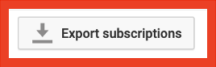
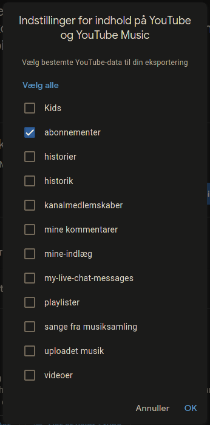

## What
Generate an opml file for your youtube subscriptions to use with an rss reader.
..or just a list of channel names or URLs.

## Why
Youtube used to have this button

<a href="url"></a>

This unfortunate button has been deleted by the dark overlords at youtube and is now a thing of the past

## How
Go to https://takeout.google.com/takeout/custom/youtube  
Choose Data >> Deselect everything except for subscribtions

<a href="url"></a>

Click Next >> Choose Export Once >> Click Create Export >> Click Download

The name of the file you get might depend on your locale, but it should be something like subscriptions.json

Configure 📂 [ytexport.js](./ytexport.js)
``` js 
// Replace subscriptions.json with the path to your youtube subscriptions json file
var subs = require('./subscriptions.json');
```
run ytexport.js using nodejs
``` shell
node ytexport.js > subscriptions.opml
```

## Other
Last tested Linux 5.9.10, fish 3.1.2, node v15.3.0 - 2020-12-16T00:27:43 CET

If there are any problems open an issue.

Similar:
[json-to-opml](https://github.com/jairsjunior/json-to-opml)
